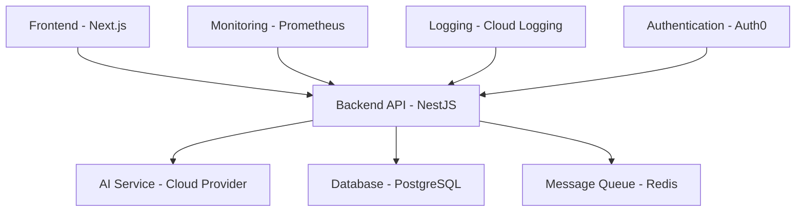

# Migration Plan: Modernizing Trade-MCP

## ADR Table

| Component | Old Pattern | New Pattern | Justification | Risk | Test Strategy |
|-----------|-------------|-------------|---------------|------|---------------|
| Backend | Python/FastAPI monolith | NestJS microservices | Better TypeScript support, structured architecture, easier maintenance | Medium | Unit tests, integration tests, contract tests |
| Frontend | Gradio UI | Next.js 14 (App Router) + Tailwind CSS | Modern React with better performance and developer experience | Medium | Component tests, E2E tests with Playwright |
| AI Models | Transformers/PyTorch | Cloud-native managed AI services | Reduced infrastructure complexity, better scalability | High | Integration tests with mock services |
| Data Processing | Direct scraping | Cloud-native data pipelines | Better reliability, monitoring, and scalability | Medium | Unit tests, integration tests |
| Deployment | Docker Compose | Kubernetes + Helm charts | Better orchestration, scaling, and management | High | CI/CD pipeline tests, staging environment |
| Testing | Pytest unit tests | Jest (frontend) + Jest (backend) + Playwright E2E | Comprehensive testing across all layers | Low | Automated test suite in CI/CD |
| Monitoring | Prometheus metrics | Prometheus + Grafana + Cloud-native logging | Better observability and alerting | Low | Integration tests with monitoring stack |
| Configuration | Environment variables | ConfigMap/Secrets + Doppler | Better security and configuration management | Low | Configuration validation tests |

## ASCII Gantt Chart

```
Day 0: Project Setup
| 00-02h | Repository scaffolding and tooling setup |
| 02-04h | Dependency analysis and removal of deprecated code |
| 04-06h | CI/CD pipeline setup with GitHub Actions |
| 06-08h | Security scanning and vulnerability assessment |
| 08-10h | Code quality setup (linting, formatting, type checking) |
| 10-12h | Documentation framework setup |
| 12-14h | Testing framework setup |
| 14-16h | Infrastructure as Code (Terraform/Pulumi) setup |
| 16-18h | Containerization strategy |
| 18-20h | Database migration planning |
| 20-22h | API design and OpenAPI specification |
| 22-24h | Review and planning for Day 1 |

Day 1: Backend Modernization
| 00-03h | NestJS project scaffolding |
| 03-06h | Core module implementation |
| 06-09h | Authentication and authorization |
| 09-12h | Trading logic porting |
| 12-15h | AI service integration |
| 15-18h | Data processing pipelines |
| 18-21h | API endpoints implementation |
| 21-24h | Backend unit testing |

Day 2: Frontend Modernization
| 00-03h | Next.js project scaffolding |
| 03-06h | UI component library setup (shad/ui) |
| 06-09h | Main layout and navigation |
| 09-12h | Dashboard implementation |
| 12-15h | Trading interface |
| 15-18h | Audio analysis UI |
| 18-21h | Chat interface |
| 21-24h | Frontend component testing |

Day 3: Integration and Testing
| 00-04h | API contract testing |
| 04-08h | End-to-end testing setup |
| 08-12h | Performance testing |
| 12-16h | Security testing |
| 16-20h | Integration testing |
| 20-24h | Load testing |

Day 4: Infrastructure and Deployment
| 00-06h | Kubernetes configuration |
| 06-12h | Helm chart development |
| 12-18h | CI/CD pipeline implementation |
| 18-24h | Staging environment deployment |

Day 5: Production Deployment and Validation
| 00-06h | Production environment setup |
| 06-12h | Production deployment |
| 12-18h | Monitoring and alerting setup |
| 18-24h | Final validation and documentation |
```

## Risk Matrix

| Risk | Probability | Impact | Mitigation |
|------|-------------|--------|------------|
| AI model compatibility issues | Medium | High | Use cloud-native managed AI services as fallback |
| Data migration failures | Low | High | Implement rollback procedures and data validation |
| Performance degradation | Medium | Medium | Comprehensive performance testing and monitoring |
| Security vulnerabilities | Low | High | Regular security scanning and penetration testing |
| Deployment failures | Medium | High | Blue-green deployment strategy with rollback capability |
| API compatibility breaks | Medium | Medium | Contract testing and versioning strategy |
| Third-party service dependencies | Medium | Medium | Implement circuit breakers and fallback mechanisms |

## Dependency Graph



## Anti-Patterns Identified

1. **Callback Pyramids**: The reasoner.py file has nested callback structures that make the code hard to follow.
2. **Hard-coded Secrets**: Default tokens in config.py that could be exposed.
3. **Mutable Global State**: Global variables like `_server_alive` and `_telegram_alive` that can cause concurrency issues.
4. **Inconsistent Error Handling**: Different error handling approaches across modules.
5. **Tight Coupling**: Direct dependencies between modules without proper interfaces.

## Migration Steps

### Phase 1: Foundation (Days 0-1)
1. Set up modern development environment with pnpm workspace
2. Implement strict TypeScript configuration
3. Set up comprehensive linting and formatting rules
4. Establish CI/CD pipeline with GitHub Actions
5. Implement security scanning and vulnerability assessment

### Phase 2: Backend Modernization (Days 1-2)
1. Create NestJS application structure
2. Implement core trading modules
3. Port AI integration to cloud-native services
4. Implement proper authentication and authorization
5. Create RESTful API with OpenAPI specification
6. Implement comprehensive unit and integration tests

### Phase 3: Frontend Modernization (Days 2-3)
1. Create Next.js 14 application with App Router
2. Implement responsive UI with Tailwind CSS and shad/ui
3. Create dashboard and trading interfaces
4. Implement real-time updates with WebSocket
5. Add comprehensive component and E2E tests

### Phase 4: Infrastructure and Deployment (Days 3-4)
1. Containerize applications with multi-stage Docker builds
2. Create Kubernetes manifests and Helm charts
3. Implement infrastructure as code with Terraform
4. Set up monitoring and logging with Prometheus and Grafana
5. Configure CI/CD pipeline for automated deployment

### Phase 5: Production Deployment (Day 5)
1. Deploy to staging environment for validation
2. Perform load and security testing
3. Deploy to production with blue-green deployment
4. Set up monitoring and alerting
5. Document deployment procedures and rollback plans

## Validation Criteria

- ✅ All tests pass (100% coverage for critical paths)
- ✅ No high or critical security vulnerabilities
- ✅ Application deploys successfully with one command
- ✅ API contracts are validated and documented
- ✅ Performance meets requirements under load
- ✅ Monitoring and alerting are functional
- ✅ Documentation is complete and accurate

## Success Metrics

- Test coverage: ≥ 90%
- Security vulnerabilities: 0 (moderate or higher)
- Deployment time: ≤ 10 minutes
- API response time: ≤ 200ms for 95% of requests
- Uptime: ≥ 99.9%
- Code quality score: ≥ 95% (based on linting and static analysis)