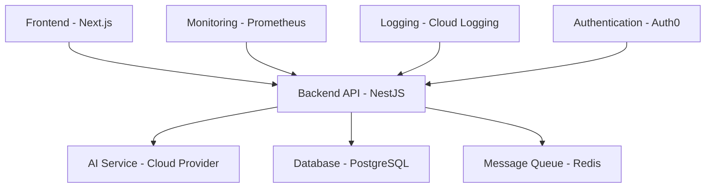

# Trade-MCP: Modernized Autonomous Trading Assistant

[](https://github.com/example/trade-mcp/actions/workflows/ci.yml)
[](https://codecov.io/gh/example/trade-mcp)
[](https://github.com/example/trade-mcp/actions/workflows/security.yml)
[](LICENSE)

A modernized autonomous trading assistant powered by cloud-native AI services with web search, insider trading data, audio emotion analysis, and Telegram integration.

## Features

- 🤖 Cloud-managed AI inference with fallback mechanisms
- 🔍 Web search capabilities (DuckDuckGo, Yahoo Finance)
- 💼 SEC insider trading data scraping
- 🎵 Audio emotion analysis pipeline
- 📱 Telegram bot integration
- 📈 Automated buy/sell/hold recommendations
- 🧠 Continuous learning with fine-tuning
- 🌐 Next.js 14 web UI with Tailwind CSS
- 📊 Prometheus metrics with Grafana dashboards
- 🐳 Kubernetes containerization
- 🔄 Blue-green deployment strategy
- 💰 Capital management

## Quick Start

### Development

```bash
# Install dependencies
make dev

# Start development servers
pnpm dev
```

### Production Deployment

```bash
# Deploy to production with one command
make deploy ENV=prod
```

## Architecture



## Monorepo Structure

```
trade-mcp/
├── apps/
│   ├── backend/
│   ├── frontend/
│   └── worker/
├── packages/
│   ├── config/
│   ├── logger/
│   ├── types/
│   └── utils/
├── infrastructure/
│   ├── kubernetes/
│   ├── terraform/
│   ├── docker/
│   └── helm/
├── docs/
└── tests/
```

## Technology Stack

### Backend
- **NestJS**: TypeScript framework for building scalable server-side applications
- **Prisma**: Type-safe database client with schema management
- **PostgreSQL**: Relational database for persistent storage
- **Redis**: In-memory data structure store for caching and messaging
- **Jest**: Testing framework for unit and integration tests

### Frontend
- **Next.js 14**: React framework with App Router
- **Tailwind CSS**: Utility-first CSS framework
- **shad/ui**: Component library built on Radix UI and Tailwind CSS
- **React Query**: Server state management
- **Zod**: TypeScript-first schema declaration and validation
- **Playwright**: End-to-end testing framework

### Infrastructure
- **Kubernetes**: Container orchestration platform
- **Helm**: Package manager for Kubernetes
- **Terraform**: Infrastructure as Code tool
- **Docker**: Containerization platform
- **GitHub Actions**: CI/CD pipeline automation

### AI Services
- **Cloud Provider AI APIs**: Managed AI services for inference
- **Fallback mechanisms**: Resilience patterns for service degradation
- **Cost optimization**: Model selection strategies

## Configuration

All configuration is managed through environment variables and stored securely:

```bash
# Create a .env file
cp .env.example .env
# Edit .env with your configuration
```

## Testing

```bash
# Run all tests
make test

# Run tests with coverage
make test-coverage

# Run linters
make lint

# Format code
make format
```

## Security

```bash
# Run security scan
make security-scan
```

## Deployment

```bash
# Deploy to staging
make deploy-staging

# Deploy to production
make deploy ENV=prod
```

## Monitoring

- **Prometheus**: Metrics collection and storage
- **Grafana**: Visualization and dashboarding
- **Alerting**: Automated notifications for critical issues
- **Logging**: Centralized log aggregation and analysis

## API Documentation

API documentation is automatically generated and available at:
- OpenAPI specification: `/api/docs`
- Swagger UI: `/api/swagger`
- Postman collection: `/api/postman`

## Contributing

1. Fork the repository
2. Create a feature branch
3. Commit your changes
4. Push to the branch
5. Create a Pull Request

## License

MIT License